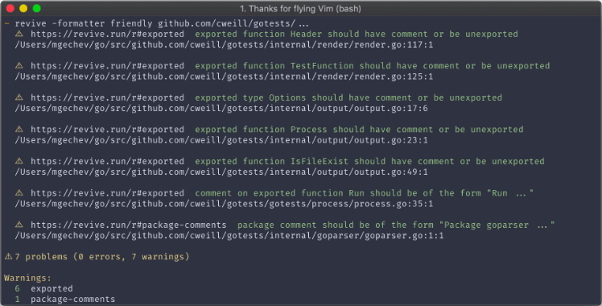
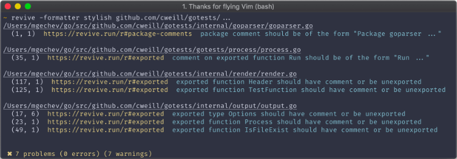
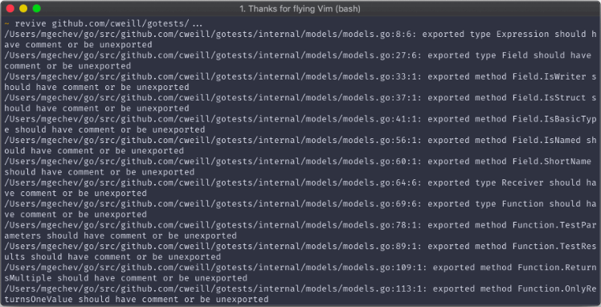

# 从0到1创建一个golang项目


## 背景
    1、公司正在推golang转型，新项目建议使用golang实现
    2、原本python项目使用golang重构


## 创建项目仓库
**step1** 
> 公司使用governance项目来管理所有的项目，按照团队进行划分，需要首先将新增项目添加到governance项目中
> 
> 可以参考如下patch作为提交模板：
> 
> [governance新增项目提交模板](https://review.easystack.cn/c/easystack/governance/+/53369)，目前已实现自动化，上面patch merge后会自动创建出新的项目。

**step2**
> 在新项目提交第一笔patch之前，需要先确保gerrit中已经新建好对应的新项目，否则不能正常触发CI，可以参考下面两个patch：
> 
> https://review.easystack.cn/#/c/49507/
> 
> https://review.easystack.cn/#/c/49508/ 
> 
<font color=#ff6600>**上述操作步骤操作详情都在[CICD文档](https://easystack.atlassian.net/wiki/spaces/DEV/pages/814483517/CI+CD)中有详细介绍**</font>


## 项目结构规划
> Go项目结构规划目前并没有官方的统一规范，但是也有一些比较好的模板可以参考，随着项目的增长，合理的项目结构会显得非常重要。

**一个Go项目完整的目录及文件规划**
一级目录|二级目录|三级目录或文件|说明
------|------|-------------|---
项目名称|||
||api||对外接口目录
|||api.go||定义对外接口
||build||安装包和持续集成相关文件
||CHANGELOG||项目更新记录
||cmd||应用程序入口目录，不同应用程序按子目录划分
|||service1|
|||service2|
||config||配置文件目录
||CONTRIBUTING.md||如果是开源项目，需要说明如何贡献代码、开源协同等
||deployment||部署配置目录
||docs||文档目录，存放设计文档、开发文档、用户文档等
||examples||样例代码目录
||go.mod||Go语言包管理工具，自动生成
||go.sum||Go语言包管理工具，自动生成
||init||初始化系统和进程管理配置文件
||internal||接口实现目录，并按功能分成不同的子目录，internal是Go语言定义的package，internal package只有同一级目录下的Go程序才能访问
|||apiserver|应用实现代码目录
|||pkg|项目内共享代码目录
||lib||开发态依赖的动态库，主要用于CGo场景
||LICENSE||版权文件
||Makefile||项目管理工具，用来执行静态代码检查、单元测试、编译等
||pkg||接口实现目录，按照功能分成不同子目录，项目外可以共享
|||moduleA|功能模块A
|||moduleB|功能模块B
||README.md||项目介绍，采用markdown标签语言
||scripts||脚本目录，实现编译、安装、代码静态检查等功能
||test||外部测试应用程序和测试数据
||third_party||第三方应用目录
||tools||工具目录，
||vendor||第三方依赖源码目录，vendor是Go语言定义的特殊目录，编译时会优先查找该目录下的依赖源码，可通过`go mod vendor`自动生成

<font color=#ff6600>然而我们平时大多是开发一个小型项目，可能用不到这么多目录。故只保留必要的目录和文件，其他内容后面按需创建。</font>

**建议的项目结构规划**

一级目录|二级目录|三级目录或文件|说明
-------|------|------------|---
项目名称|||
||cmd||应用程序入口目录
||internal||接口实现目录，并按功能分成不同的子目录，项目内可以共享
||Makefile||项目管理工具，用来执行静态代码检查、单元测试、编译等
||pkg||接口实现目录，按照功能分成不同子目录，项目外可以共享
||README.md||项目介绍，采用markdown标签语言

Ref：[github.com/golang-standards/project-layout](https://github.com/golang-standards/project-layout)

[Go项目模板](https://github.com/jyjiangkai/golang-project-template)


## 包依赖管理（Go Modules）
> 从Go 1.11开始增加了对go modules的支持，从Go 1.14开始正式用于生产环境。Go Modules解决了项目对GOPATH的依赖，Golang官方也在逐步淡化GOPATH的概念。

[go modules官方wiki介绍](https://github.com/golang/go/wiki/Modules)

**Go Modules主要涉及如下文件及环境变量**
* go.mod
> go.mod是启用了go module的项目所必须的文件，它描述了项目的元数据。通过`go mod init {project_name}`初始化项目，并自动生成go.mod文件。下面给出一个go.mod例子：
> ```
> module github.com/goproxy/goproxy
> 
> go 1.13
> 
> require (
> 	github.com/davecgh/go-spew v1.1.1 // indirect
> 	github.com/kr/pretty v0.1.0 // indirect
> 	github.com/stretchr/testify v1.7.0
> 	golang.org/x/crypto v0.0.0-20210513164829-c07d793c2f9a // indirect
> 	golang.org/x/mod v0.4.2
> 	golang.org/x/net v0.0.0-20210525063256-abc453219eb5
> 	golang.org/x/xerrors v0.0.0-20200804184101-5ec99f83aff1 // indirect
> )
> 
> exclude golang.org/x/mod v0.4.3
> 
> replace golang.org/x/net => golang.org/x/net v0.2.1
> ```
> module: 定义当前项目的模块路径
> go：设置golang版本
> require：定义需求的模块及其特定的版本
> exclude：从使用中排除一个特定版本的模块
> replace：用于将一个模块版本替换为另一个模块版本

* go.sum
> go.sum罗列了当前项目直接或间接依赖的所有模块版本，并写明了那些模块版本的SHA-256哈希值，以备Go在今后的操作中保证项目所依赖的那些模块版本不会被篡改。
> 下面给出一个go.sum的部分样例：
> ```
> github.com/davecgh/go-spew v1.1.0/go.mod h1:J7Y8YcW2NihsgmVo/mv3lAwl/skON4iLHjSsI+c5H38=
> github.com/davecgh/go-spew v1.1.1 h1:vj9j/u1bqnvCEfJOwUhtlOARqs3+rkHYY13jYWTU97c=
> github.com/davecgh/go-spew v1.1.1/go.mod h1:J7Y8YcW2NihsgmVo/mv3lAwl/skON4iLHjSsI+c5H38=
> github.com/goproxy/goproxy v0.7.1 h1:xHGP4i/5e7zqJBV0g9lW28pTyinnL6QSk7HbiezvE2o=
> github.com/goproxy/goproxy v0.7.1/go.mod h1:t7TgiBtHO97i8gJXJGgLxNDc5d7y+JdjcQM4ZCSRgbo=
> ```

* GO111MODULE
> 开关环境变量。支持三个配置值：
> > * `auto`
> > > 仅当项目包含了go.mod文件时启用go modules
> > * `on`
> > > 启用go modules
> > * `off`
> > > 禁用go modules
>
> <font color=#ff0000>Go 1.16之前默认值为auto，Go 1.16开始默认值为on。</font>

* GOPROXY
> 它是一个以英文逗号`','`分隔的`go module proxy`列表。默认值为`https://proxy.golang.org,direct`，但由于`proxy.golang.org`在国内无法访问，故建议修改为`goproxy.cn`,可直接执行`go env -w GOPROXY=https://goproxy.cn,direct`
>
> `direct`是一个特殊指示符，用于指示Go回源到模块版本的源地址获取（如github.com）
>
> 由于该变量是一个列表，所以当访问第一个proxy失败时会自动尝试列表中的下一个proxy，直到遇到direct去源站获取。
* GOSUMDB
> 它的值是一个go checksum database，用于使go在拉取模块版本时保证拉倒的模块版本数据未经篡改。默认值为`sum.golang.org`，由于`sum.golang.org`在国内也是无法访问的，故需要修改GOPROXY为`goproxy.cn`，`goproxy.cn`支持代理`sum.golang.org`。

* GONOPROXY、GONOSUMDB、GOPRIVATE
> 这三个环境变量的值都是一个以英文逗号`','`分隔的模块路径前缀，主要应用场景是当前项目模块依赖了私有模块时，通过GOPROXY无法访问到该私有模块的场景。GOPRIVATE是作为GONOPROXY、GONOSUMDB的默认值，故平时使用也只需要配置GOPRIVATE即可。
> 如配置`go env -w GOPRIVATE=*.corp.example.com`，则匹配该模块的域名都直接回源，不走代理。

* Global Caching
> 全局缓存，同一个模块版本只缓存一份。所有模块版本数据均缓存在`$GOPATH/pkg/mod`和`$GOPATH/pkg/sumdb`下，Go 1.15版本新增了一个[GOMODCACHE](https://golang.org/doc/go1.15#go-command)用于缓存模块版本数据，默认值为`$GOPATH/pkg/mod`。
> 
> 在Go 1.15发布之前，有关于[不建议将模块缓存放到GOCACHE中](https://groups.google.com/forum/#!msg/golang-dev/RjSj4bGSmsw/KMHhU8fmAwAJ)的讨论。
> 
> 可以使用`go clean -modcache`清理所有已缓存的模块版本数据

* `go mod`子命令
> * 使用`go get`拉取新的依赖
> > ```
> > go get golang.org/x/text@latest  #拉取最新版本（优先选取tag）
> > go get golang.org/x/text@master  #拉取master分支的最新commit
> > go get golang.org/x/text@v0.3.2  #拉取tag为v0.3.2的commit
> > go get golang.org/x/text@342b2e1 #拉取hash为342b2e1的commit，最终会被转换为v0.3.2
> > ```
> * 使用`go get -u`强制使用网络去更新包和它的依赖包
> * 使用`go mod download`下载go.mod指定的依赖包
> * 使用`go mod tidy`拉取缺少的模块，移除不用的模块
> * 使用`go mod graph`查看现有依赖结构
> * 使用`go mod init`初始化模块，生成go.mod文件
> * 使用`go mod edit`编辑go.mod文件
> * 使用`go mod vendor`导出依赖包到vendor目录
> * 使用`go mod vetify`校验依赖包是否被篡改

* Live Demo


## Continuous Integration（持续集成）
GO项目CI采用Makefile的方式定义执行入口，需要在项目的根目录下加入Makefile，并设置如下4个entrypoints

* **make copy-{project_name}**

  用于将项目拷贝到CI环境的GOPATH下，也是作为下面三个检查任务的预置任务.

* **make test-style**

  用于进行代码的风格测试

* **make test-unit**

  用于进行代码的UT测试

* **make coverage**

  用于进行代码的覆盖率测试

<font color=#ff0000>**如果上述测试结果不满足条件，需要将该make执行返回值返回非0即可（例如exit 255）**</font>

上述配置也可以参见CICD文档内容：[Golang项目CI使用说明](https://easystack.atlassian.net/wiki/spaces/DEV/pages/1169391869/CI+CD)


### test-style
[golint](https://github.com/golang/lint)
> golint项目是一个go代码静态检查工具，他不同于gofmt是用于格式化Go源代码，也不同于govet着重于检查代码格式错误，golint是检查代码编写规范。但目前该项目已经弃用，主要是因为该项目有误报和漏报。

[revive](https://github.com/mgechev/revive)
> 取而代之，revite项目能直接替换golint，同时，revive还具备以下优势：
> * 支持配置文件启动或禁用规则
> * 运行和golint相同的规则速度快2倍
> * 支持禁用文件或代码行范围的特定规则
> * 支持可选的类型检查(golint中大多数规则不需要检查，如果禁用，revive的运行速度快6倍)
> * 支持多种格式化输出报告
> * 允许对整个linter或部分规则自定义返回码
> * 可扩展自定义规则
> * 提供更多的检查规则

 - 包括etcd在内的很多项目都是直接使用的revive做代码风格检查。

**Usage**
```shell
root@jiangkai-HP:/home/jiangkai# revive -h

 _ __ _____   _(_)__  _____
| '__/ _ \ \ / / \ \ / / _ \
| | |  __/\ V /| |\ V /  __/
|_|  \___| \_/ |_| \_/ \___|

Example:
  revive -config c.toml -formatter friendly -exclude a.go -exclude b.go ./...

Usage of revive:
  -config string
    	path to the configuration TOML file, defaults to $HOME/revive.toml, if present (i.e. -config myconf.toml)
  -exclude value
    	list of globs which specify files to be excluded (i.e. -exclude foo/...)
  -formatter string
    	formatter to be used for the output (i.e. -formatter stylish)
  -version
    	get revive version
```

**注释指令**
> 使用注释可以禁用整个文件或指定行范围的linter
> ```golang
> //revive:disable
> func Public() {}
> //revive:enable
> ```
> 上述代码将禁用 `revive:disable` 和 `revive:enable` 之间代码行的linter，如果去掉 `revive:enable` 注释行，则禁用该文件剩余代码行的linter。
> 
> 使用 `revive:disable-next-line` 和 `revive:disable-line` 可以禁用特定代码行的linter
> ```golang
> //revive:disable-next-line
> func  Public() {}  //revive:disable-line
> ```
> 
> 如果只想禁用特定规则，可以使用 `revive:disable:unexported-return` 和 `revive:enable:unexported-return`
> 
> 可以使用 `revive:disable 直到代码稳定` 记录禁用原因
> 

**配置**
> revive使用TOML文件进行配置，下面是推荐配置示例：
> ```toml
> ignoreGeneratedHeader = false
> severity = "warning"
> confidence = 0.8
> errorCode = 0
> warningCode = 0
> 
> [rule.blank-imports]
> [rule.context-as-argument]
> [rule.context-keys-type]
> [rule.dot-imports]
> [rule.error-return]
> [rule.error-strings]
> [rule.error-naming]
> [rule.exported]
> [rule.if-return]
> [rule.increment-decrement]
> [rule.var-naming]
> [rule.var-declaration]
> [rule.package-comments]
> [rule.range]
> [rule.receiver-naming]
> [rule.time-naming]
> [rule.unexported-return]
> [rule.indent-error-flow]
> [rule.errorf]
> [rule.empty-block]
> [rule.superfluous-else]
> [rule.unused-parameter]
> [rule.unreachable-code]
> [rule.redefines-builtin-id]
> ```
> revive仅启动在配置文件中已指定的检查规则
> 

**可用规则**
> revive支持的所有可用规则可查看 [revive可用规则](https://github.com/mgechev/revive#available-rules)

**可用格式化输出**
> 前面提到revive支持多种格式化输出，下面列举了部分可用的格式化程序输出：
* friendly
    
* stylish
    
* default
    

**可扩展**
> 支持用户自定义检查规则或格式化输出，这里不详述。

**性能对比**
> 与golint相比，revive性能更好，原因是因为revive将每一项检查规则放到单独goroutine中处理。
> 下面是2013年基于Kubernetes项目的性能测试数据对比
* golint
```
time golint kubernetes/... > /dev/null

real    0m54.837s
user    0m57.844s
sys     0m9.146s
```
* revive
> 如果不开启类型检查，性能是golint的6倍
```
# no type checking
time revive -config untyped.toml kubernetes/... > /dev/null

real    0m8.471s
user    0m40.721s
sys     0m3.262s
```
> 如果开启类型检查，性能是golint的2倍
```
# type checking enabled
time revive kubernetes/... > /dev/null

real    0m26.211s
user    2m6.708s
sys     0m17.192s
```

<font color=#ff0000>**上面介绍了直接使用revive，除此之外，revive还可以通过集成到golangci-lint来使用**</font>

[golangci-lint](https://github.com/golangci/golangci-lint)
> golangci-lint是一个lint执行器，它集合了revive在内的数十种linter，同时，目前已经集成了包括vscode在内的所有主流IDE。
> golangci-lint从v1.14.0版本开始使用revive替换掉了golint
> ```
> WARN [runner] The linter 'golint' is deprecated (since v1.41.0) due to: The repository of the linter has been archived by the owner.  Replaced by revive.
> ```
> golangci-lint官方文档托管在 [golangci-lint](https://golangci-lint.run)

- 包括Kubernetes、containerd、runc在内的很多项目都是使用的golangci-lint做lint检查。

**Features**
* 非常快：并行运行linter，重新用Go构建缓存模块并且缓存了分析结果
* 基于Yaml的配置文件
* 集成了所有主流IDE
* 集合了大量linter，不需要单独安装
* 优化了默认配置从而有最小的误报数
* 漂亮的输出颜色、源代码以及标识符

**Usage**
```sh
golangci-lint run
golangci-lint run ./...
golangci-lint run dir1 dir2/... dir3/file1.go
```
> 目录不支持递归分析。如果需要递归分析，需要在目录后添加`/...`
>
> golangci-lint可以不带配置运行，这时候会采用默认配置启动linter
> 
> golangci-lint默认配置可以通过下面命令查看：
```sh
golangci-lint help linters
```
> 可以通过`-E/--enable`启用一个linter或者使用`-D/--disable`禁用一个linter
```sh
golangci-lint run --disable-all -E errcheck
```
[默认开启的Linters](https://golangci-lint.run/usage/linters/#enabled-by-default-linters)

> golangci-lint配置基于Yaml文件格式，示例如下：
> ```yaml
> linters-settings:
>   gocyclo:
>     # minimal code complexity to report, 30 by default (but we recommend 10-20)
>     min-complexity: 10
> ```

**缓存**
> GolangCI Lint将其缓存存储在默认的用户缓存目录`${HONME}/.cache`中。
>
> 可以使用环境变量`GOLANGCI_LINT_CACHE`覆盖默认缓存目录，路径必须是绝对路径。

**误报**
> 误报在所难免，如果发现误报，可以通过下面三种方式来处理：
> 1. 使用命令行参数`-e`进行屏蔽
> 2. 使用代码行注释`//nolint`进行屏蔽
> ```golang
> var bad_name int //nolint
> var bad_name int //nolint:golint,unused
> 
> //nolint:govet
> var (
>   a int
>   b int
> )
> 
> //nolint:unparam
> package pkg
> 
> //nolint:gocyclo
> func someLegacyFunction() *string {
>   // ...
> }
> ```
> 
> 3. 使用配置参数`run.skip-dirs`,`run.skip-files`或者`issues.exclude-rules`进行屏蔽
> 

**内存使用**
> 内存使用和执行时间之间的权衡可以由[GOGC](https://golang.org/pkg/runtime/debug/#SetGCPercent)环境变量控制。更少的[GOGC](https://golang.org/pkg/runtime/debug/#SetGCPercent)值会更频繁地触发垃圾收集，故golangci-lint消耗更少的内存和更多的CPU。对应数据如下：

GOGC|Peak Memory,GB|Execution Time,s
----|--------------|----------------
5   |1.1           |60
10  |1.1           |34
20  |1.3           |25
30  |1.6           |20.2
50  |2.0           |17.1
80  |2.2           |14.1
100(default)|2.2   |13.8
off |3.2           |9.3
    |              |

**Why golangci-lint is so fast**
1. 共享工作
> 在操作过程中，golangci-lint在特定的linter（如golint、govet等）之间共享工作。并不使用fork来调用特定的linter，而是通过API进行调用。对于中小型项目，50-90%linter的工作可以重复使用。
>
> * 只加载一次[]*packages.Package
> > 为所有linter只加载一次程序（解析所有文件和类型检查）。对于大多数linter来说，这是最繁重的操作：8kloc repo需要5秒，$GOROOT/src需要11秒。
> * 只构建一次ssa.Program
> > 一些linter（megacheck、interfacer、unparam）工作在SSA对象上。在8kloc repo上创建这个对象需要1.5秒，在$GOROOT/src上需要6秒。
> * 只解析一次源代码并构建AST
> > 解析一个源文件平均需要200us。解析$GOROOT/src中的所有文件需要2s。
> * 只一次遍历文件和目录
> > $GOROOT/src需要300-1000毫秒。
2. 智能调度
> 通过一种特殊的算法来调度linter，该算法考虑了预估的执行时间。当启用一个复杂linter（megacheck等）时，它能节省10-30%的时间。
3. 不使用fork来运行shell命令
> 通过go mod，所有linter都有固定的版本，都是内置的，不需要单独安装。

**综上所述，我们建议在Go项目中使用golangci-lint来做代码静态检查，它即包含了revive的检查，还提供了其他更多的linter供我们灵活选择。我这边完成了一个golangci-lint的参考实现，在默认配置的基础上，加入了revive和cyclo两项检查，用于补充检查Go代码风格和圈复杂度。**

```makefile
# there is makefile for golangci-lint best practices
golangci-lint run \
  --timeout 30m \
  -E gocyclo \
  -E revive
```

[golangci-lint最佳实践](https://github.com/jyjiangkai/golang-project-template)

[goreportcard](https://github.com/gojp/goreportcard)
> 该项目是一个在线的web应用程序，可以在线生成项目的检查报告。
> 
> 访问地址：[goreportcard](https://goreportcard.com/)
>


## Go UnitTest
### Golang常用的几种测试框架
测试框架|说明
-------|---
testing|Golang自带的测试框架
GoConvey|第三方测试框架，支持断言和web测试界面展示
Testify|自带Mock框架，但Mock框架使用复杂

1. [testing](https://golang.org/pkg/testing/)
* 特性
> 1. Go语言原生支持测试框架，在标准库的 [testing](https://golang.org/pkg/testing/) 包中。

* 规范
> Golang单元测试对文件名和方法名，参数都有很严格的要求。例如：
> 1. 单元测试文件名必须以xxx_test.go命名
> 2. 方法必须是TestXxx开头
> 3. 方法参数必须 t *testing.T
> 4. 测试文件和被测试文件必须在一个包中

* Live Demo

2. [GoConvey](https://github.com/smartystreets/goconvey)
* 特性
> 1. Convey 适用于书写单元测试用例，兼容 testing 框架
> 2. 支持web测试界面查看测试结果
> 3. 支持断言方法。

* 规范
> 1. import goconvey包时，前面加点号"."，以减少冗余的代码。凡是在测试代码中看到Convey和So两个方法，肯定是convey包的，不要在产品代码中定义相同的函数名
> 2. 测试函数的名字必须以Test开头，而且参数类型必须为*testing.T
> 3. 每个测试用例必须使用Convey函数包裹起来，它的第一个参数为string类型的测试描述，第二个参数为测试函数的入参（类型为*testing.T），第三个参数为不接收任何参数也不返回任何值的函数（习惯使用闭包）
> 4. Convey函数的第三个参数闭包的实现中通过So函数完成断言判断，它的第一个参数为实际值，第二个参数为断言函数变量，第三个参数或者没有（当第二个参数为类ShouldBeTrue形式的函数变量）或者有（当第二个函数为类ShouldEqual形式的函数变量）

* Live Demo

3. [Testify](https://github.com/stretchr/testify)
* 特性
> 1. testify 提供了便捷的断言方法 assert 和 require，使测试代码更加简洁
> 2. 支持mock，但使用较为复杂

### 测试框架总结
> 三种测试框架都比较简单，GoConvey虽然功能完善且支持Web测试界面展示，但是并不实用。故在测试框架的选择上，建议的最佳实践是 <font color=#ff6600>**testing + testify组合使用**</font> 。原因如下：
> 1. testing是Go原生支持的测试框架，未来可期
> 2. GoConvey项目并不活跃，已一年多未更新
> 3. testify断言方法使用简单，取长补短

### Golang常用的几种 Stub/Mock 框架
> 在编写单元测试过程中，经常会遇到和外部服务或其他模块交互的场景，这时候不好构造数据，就需要使用mock的方式来模拟。
> 
> 常见有以下几种情况下使用mock会比较好：
> 1. IO类型的，本地文件，数据库，网络API，RPC等
> 2. 依赖外部服务，即服务间测试
> 3. 压力性能测试的时候屏蔽外部依赖，专注测试本模块
> 4. 依赖的内部函数非常复杂，要构造数据非常不方便

Stub/Mock框架|说明
------------|----
GoStub|轻量级测试框架，接口友好，可以对全局变量、函数或过程打桩
GoMock|Golang官方开发维护的测试框架，支持基于interface的Mock功能，但使用较为复杂
GoMonkey|自带Mock框架，使用简单，不支持并发场景

1. [GoStub](https://github.com/golang/mock)
* 特性
> 1. 支持为全局变量打桩
> 2. 支持为函数打桩
> 3. 支持为过程打桩

* Live Demo

* 总结
> 1. 使用简单，场景单一
> 2. 不支持复杂场景（例如：为接口打桩，重复调用场景）

2. [GoMock](https://github.com/golang/mock)
* 特性
> 1. 与Golang内置testing包良好集成
> 2. 支持基于interface的Mock功能，但使用较为复杂
> 3. GoMock 测试框架包含 GoMock 包和 mockgen 工具两部分

* 规范
> 1. 定义一个接口
> 2. 生成mock类文件(使用mockgen工具)
> 3. 使用 mock 对象进行打桩测试
> > 1. 生成mock控制器
> > 2. mock对象注入控制器
> > 3. mock对象行为定义

* Live Demo

* 总结
> 1. 支持interface的mock功能
> 2. 支持行为调用的保序
> 3. 使用复杂

3. [GoMonkey](https://github.com/agiledragon/gomonkey)
* 特性
> 1. 支持为一个函数打一个桩
> 2. 支持为一个成员方法打一个桩
> 3. 支持为一个全局变量打一个桩
> 4. 支持为一个函数变量打一个桩
> 5. 支持为一个函数打一个特定的桩序列
> 6. 支持为一个成员方法打一个特定的桩序列
> 7. 支持为一个函数变量打一个特定的桩序列

* Live Demo
仅以普通函数和成员方法进行演示

* 总结
GoMonkey框架功能相对完善，使用也比较简单，不需要像gomock那样写很多代码。

### Stub/Mock框架总结
1. GoStub框架使用简单，但功能单一
2. GoMock框架使用复杂，开发效率低
3. GoMonkey框架功能相对完善，开发效率高，但不支持并发。

> 三种Mock框架进行对比，建议的最佳实践是 <font color=#ff6600>**GoStub + GoMonkey组合使用**</font>或者仅使用 <font color=#ff6600>**GoMonkey**</font>进行测试开发。

### 补充说明
* Golang默认开启了优化和内联，由于inline的性质会导致GoMonkey框架对inline函数打桩无效。

  Golang中虽然没有inline关键字，但仍存在inline函数，一个函数是否是inline函数由编译器决定。inline函数的特点是简单短小，在源代码的层次看有函数的结构，而在编译后却不具备函数的性质。inline函数不是在调用时发生控制转移，而是在编译时将函数体嵌入到每一个调用处，所以inline函数在调用时没有地址。

  <font color=#ff6600>**解决方案：通过命令行参数```-gcflags '-N -l'```禁止所有优化**</font>


## Coverage
> Go语言本身就有工具支持覆盖率报告的生成，使用方法如下：
> ```shell
> # 使用go test生成测试覆盖率数据
> go test -coverprofile=cover.out ./...
> 
> # 再通过go tool将cover.out转换成html格式的测试覆盖率报告
> go tool cover -html=cover.out
> ```

> 除此之外，业界还有比较好的第三方工具可以使用，比如[Codecov](https://about.codecov.io/)和[Coveralls](https://github.com/mattn/goveralls)
> 
> 相比而言，Coveralls和Jenkins集成的更好一些，故我们建议的覆盖率最佳实践也是使用Coveralls。

> 基本思路也是通过go test生成覆盖率报告，然后再将报告上传到goveralls。使用方法如下：
> ```shell
> # 使用go test生成测试覆盖率数据
> go test -coverprofile=cover.out ./...
> 
> # 再通过go tool将cover.out转换成html格式的测试覆盖率报告
> goveralls -coverprofile=cover.out
> ```
> 完整的覆盖率实现脚本可以参见[Go项目模板](https://github.com/jyjiangkai/golang-project-template)


## Continuous Delivery（持续交付）
项目的安装部署能力依赖与ark与cube两个项目，ark项目当前按项目已经拆分，一个新的项目也需要有一个匹配的ark-{project-name}项目，cube是负责镜像制作，当前所有项目的镜像制作都是由cube项目来管理维护的。


## 当前缺失的能力
1. 无静态检查统计报告生成
> 当前Golang项目CI中静态检查job执行完成后只能通过Jenkins执行日志查看结果，如果想要查看详细信息，需要在makefile中将详细报告打印到日志中查看，一方面查看不方便，另一方面纯文本的展示格式不足以直观的展示检查统计结果，对于某些检查项，需要跟踪到具体的文件代码行或者函数才更方便解决问题。同时，Jenkins是具备上述能力的，需要安装对应插件并和业务侧对齐接口即可。

上述问题已反馈CICD团队，并开了相关task进行跟踪。
[EAS-77114](https://easystack.atlassian.net/browse/EAS-77114)

上述介绍内容均可以参见[Go项目模板](https://github.com/jyjiangkai/golang-project-template)